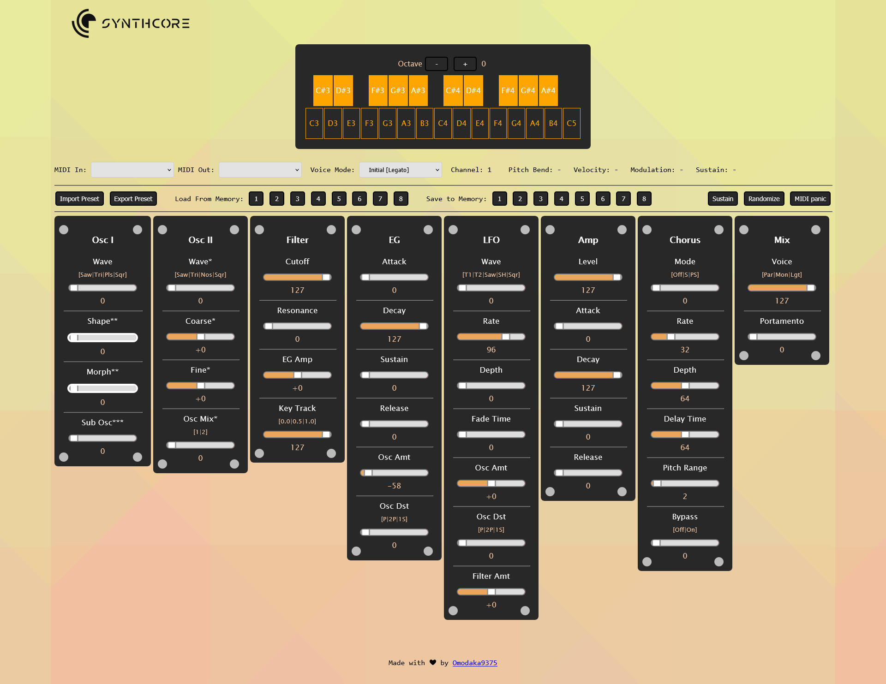

# SynthCore16 Web

<b>SynthCore16</b> is a cheap, portable and decent sounding Arduino Uno synthesizer with least amount of components and no soldering required.<br>
<b>SynthCore16 Web</b> is designed as a lightweight, portable UI for SynthCore16 synthesizer that can be controled directly from your web browser.



## Make your own SynthCore16 synthesizer

All you need is Arduino Uno and couple of cheap components:

1. Arduino Uno
2. 3.5 mm audio jack
3. 2 x 200 Ohm resistor  
4. 2 x 56k Ohm resistor
5. 2 x 10 microfarads capacitators
6. 2 x 10 nanofarads capacitators

## Schematics


## Board


## My setup (on breadboard)


## How To Use

1. Get a Arduino Uno and connect 3.5mm audio jack and other components according to diagram
2. Download "SynthCore16-ArduinoUno.hex" file and flash it to Arduino via program like XLoader: https://github.com/binaryupdates/xLoader

    <i>OR download "SynthCore16-ArduinoUno" folder. Open it in Adruino IDE, select your Uno board and upload the sketch named "SynthCore16-ArduinoUno"</i>

3. Go to https://omodaka9375.github.io/synthcore16-web/ to start playing your synth
    
    <i>OR clone this repo and run "index.html" on a local server</i>

## Features

### Sound:
- <b>Max polyphony is 6</b>
- <b>3 modes</b> (Paraphonic, Mono, Legato)
- <b>2 x Oscillators</b> (Saw, Triangle, Noise, Pulse with coarse, shape, morph and sub control)
- <b>Filter</b> (cutoff/resonance)
- <b>EG</b> (ADSR, Oscillator Distorsion)
- <b>LFO</b> (Square, Saw, SH with rate, depth and fade time control)
- <b>AMP</b> (level, ADSR)
- <b>Chorus</b> (Stereo, Pseudo-Stereo with depth, time, range nad bypass control)
- <b>Portamento</b>
- <b>Mix</b> (Voices: Paraphonic, Mono, Legato)

### Operation:
- Import/export your presets to JSON file to your computer
- Selectable midi input and output
- 8 slots to save/load presets from memory
- Supports pitchbend, velocity, modulation ans sustain
- Keyboard with octaves and key tracker (shows pressed keys on screen)


## Keyboard shortcuts
You can use your keyboard to play the synth if you dont have any usb controlers at hand.

Here are some handy shortcutes:
- ```m``` | sustain toggle
- ```,``` | midi panic(kill all sounds) (<)
- ```.``` | randomize preset (>)
- ```-``` | octave down (-)
- ```=``` | octave up (+)

## MIDI implementation chart

[SynthCore16 MIDI](./SynthCore16-MIDI-Implementation-Chart.md)

## Parameter guide

[SynthCore16 Parameters](./SSynthCore16-Parameter-Guide.md)

## Operation guide

[SynthCore16 Operation](./SSynthCore16-Operation-Guide.md)